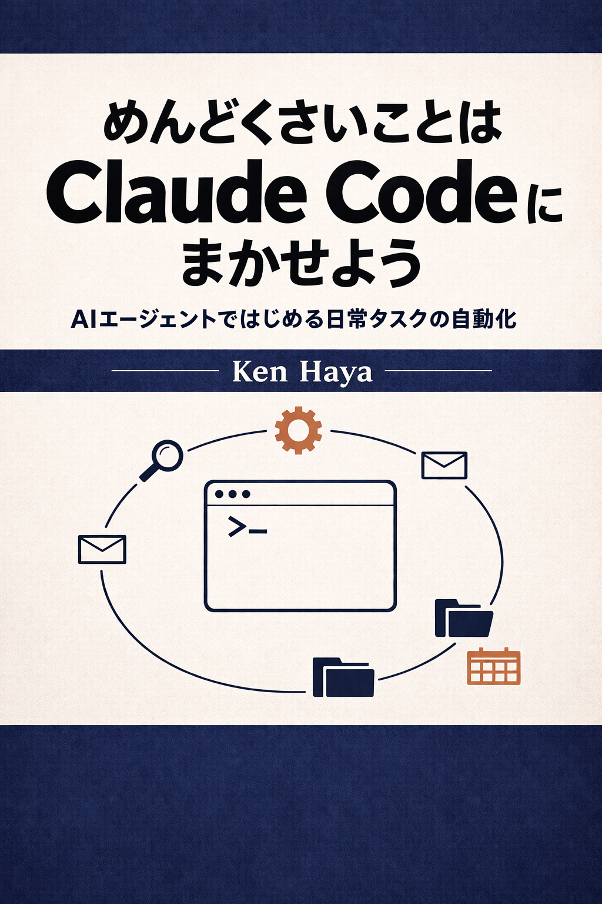

# めんどくさいことはClaude Codeにまかせよう — サンプルファイル集

<p align="center">
  
</p>

[](LICENSE)

書籍「**めんどくさいことはClaude Codeにまかせよう — AIエージェントではじめる日常タスクの自動化**」（Ken Haya 著）で紹介しているサンプルファイル、設定テンプレート、スキル定義を章ごとにまとめたリポジトリです。

## クイックスタート

### 方法1: Claude Codeでダウンロード（推奨）

Claude Codeを起動して、以下のように指示するだけです:

```
> https://github.com/kenhaya-book/tedious-stuff-claude-code-samples をクローンして
```

### 方法2: ターミナルでダウンロード

```bash
git clone https://github.com/kenhaya-book/tedious-stuff-claude-code-samples.git
cd tedious-stuff-claude-code-samples
```

### 方法3: ZIPでダウンロード

このページ上部の緑色の「Code」ボタン → 「Download ZIP」をクリックし、展開してください。

---

## サンプルファイルの使い方

### settings.json（権限・Hook設定）

1. 使いたい設定ファイルを開き、内容を確認します
2. 以下のいずれかにコピーします:
   - **全プロジェクト共通**: `~/.claude/settings.json`
   - **特定プロジェクトのみ**: `プロジェクト/.claude/settings.json`
3. 必要に応じて内容をカスタマイズします

```bash
# 例: セキュリティ設定をグローバルに適用
cp ch37/settings-security.json ~/.claude/settings.json
```

> **注意**: 既存の `settings.json` がある場合は、上書きではなく内容をマージしてください。

### SKILL.md（カスタムスキル）

1. 使いたいスキルのフォルダごとコピーします
2. 配置先:
   - **個人用**: `~/.claude/skills/スキル名/SKILL.md`
   - **プロジェクト用**: `プロジェクト/.claude/skills/スキル名/SKILL.md`
3. Claude Codeを再起動すると、`/スキル名` で呼び出せます

```bash
# 例: 議事録フォーマッタースキルをインストール
cp -r ch24/skills/format-minutes ~/.claude/skills/

# Claude Codeで使う
# > /format-minutes meeting-notes.txt
```

### AGENT.md（サブエージェント定義）

1. エージェントのフォルダごとコピーします
2. 配置先:
   - **個人用**: `~/.claude/agents/エージェント名/AGENT.md`
   - **プロジェクト用**: `プロジェクト/.claude/agents/エージェント名/AGENT.md`

```bash
# 例: ファクトチェッカーエージェントをインストール
cp -r ch25/agents/fact-checker ~/.claude/agents/
```

### CLAUDE.md（プロジェクト設定テンプレート）

1. 用途に合ったテンプレートを選びます
2. プロジェクトのルートフォルダにコピーします
3. 自分の情報や要件に合わせて編集します

```bash
# 例: 非エンジニア向けグローバル設定を使う
cp appendix_e/global-non-engineer.md ~/.claude/CLAUDE.md

# プロジェクト固有の設定
cp appendix_e/project-research.md ~/my-project/CLAUDE.md
```

### MCP設定（.mcp.json）

1. 使いたいMCPサーバーの設定を選びます
2. `~/.claude.json` にコピーまたはマージします
3. 初回接続時にOAuth認証が必要なサーバーもあります

```bash
# 例: 付録Dのフル構成をコピー
cp appendix_d/mcp-full-setup.json ~/.claude.json

# または claude mcp add コマンドで個別に追加（推奨）
claude mcp add --transport http --scope user gmail https://gmail.mcp.claude.com/mcp
```

> **推奨**: JSON ファイルを直接編集するよりも、`claude mcp add` コマンドを使う方が安全です。

### CSVデータ・シェルスクリプト

練習用データやスクリプトは、任意のフォルダにコピーして使ってください。

```bash
# 例: 練習用CSVをホームディレクトリにコピー
cp ch14/sales.csv ~/
cp ch14/dirty_data.csv ~/

# シェルスクリプトに実行権限を付与
chmod +x ch17/new_project.sh
chmod +x ch23/hooks/session-start.sh
```

---

## ファイルの配置先ガイド

| ファイルの種類 | 配置先 |
|---------------|--------|
| グローバルCLAUDE.md | `~/.claude/CLAUDE.md` |
| ルールファイル | `~/.claude/rules/*.md` |
| ユーザーsettings.json | `~/.claude/settings.json` |
| プロジェクトsettings.json | `プロジェクト/.claude/settings.json` |
| MCP設定 | `~/.claude.json`（ユーザー）or `プロジェクト/.mcp.json`（プロジェクト） |
| スキル（個人） | `~/.claude/skills/スキル名/SKILL.md` |
| スキル（プロジェクト） | `プロジェクト/.claude/skills/スキル名/SKILL.md` |
| エージェント（個人） | `~/.claude/agents/エージェント名/AGENT.md` |
| エージェント（プロジェクト） | `プロジェクト/.claude/agents/エージェント名/AGENT.md` |
| Hookスクリプト | `プロジェクト/.claude/hooks/スクリプト名.sh` |

---

## ディレクトリ構成

```
samples/
├── ch04/          第4章: Claude Codeの基本操作
│   └── sales.csv
├── ch06/          第6章: CLAUDE.md
│   ├── global-claude.md
│   ├── project-claude-manual.md
│   ├── project-claude-sales.md
│   └── rules/
├── ch14/          第14章: データの整理と分析
│   ├── sales.csv
│   ├── config.json
│   └── dirty_data.csv
├── ch17/          第17章: ファイル管理と整理術
│   └── new_project.sh
├── ch22/          第22章: 権限設定を使いこなす
│   ├── settings-basic.json
│   ├── settings-bash-permissions.json
│   ├── settings-file-access.json
│   ├── settings-mcp-permissions.json
│   └── settings-web-domain-restrict.json
├── ch23/          第23章: Hooks
│   ├── settings-hooks-basic.json
│   ├── settings-hooks-session.json
│   ├── settings-hooks-slack-notify.json
│   └── hooks/session-start.sh
├── ch24/          第24章: カスタムスキル
│   └── skills/ (6スキル)
├── ch25/          第25章: サブエージェント
│   ├── agents/ (2エージェント)
│   └── skills/ (1スキル)
├── ch27/          第27章: 個人タスク管理システム
│   ├── skills/ (4スキル)
│   └── mcp-servers.json
├── ch37/          第37章: セキュリティと安全な運用
│   ├── settings-security.json
│   └── env.example
├── ch38/          第38章: Agent Teams
│   ├── settings-agent-teams.json
│   └── agents/ (3エージェント)
├── ch39/          第39章: 設定の完全ガイド
│   ├── settings-complete.json
│   └── mcp-config.json
├── appendix_d/    付録D: MCPサーバー設定テンプレート集
│   └── (9設定ファイル)
├── appendix_e/    付録E: CLAUDE.mdテンプレート集
│   └── (9テンプレート)
├── LICENSE        MITライセンス
└── README.md      このファイル
```

---

## 各章のサンプル詳細

### ch04/ — Claude Codeの基本操作（第4章）

| ファイル | 内容 |
|---------|------|
| `sales.csv` | 練習用の売上CSVファイル（ヘッダー＋3行） |

### ch06/ — CLAUDE.md（第6章）

| ファイル | 内容 |
|---------|------|
| `global-claude.md` | グローバルCLAUDE.mdの例（`~/.claude/CLAUDE.md`として使用） |
| `project-claude-manual.md` | 社内マニュアル作成プロジェクト用CLAUDE.md |
| `project-claude-sales.md` | 営業担当者向けCLAUDE.md |
| `rules/01-user-info.md` | ルールファイル例: ユーザー情報 |
| `rules/02-language.md` | ルールファイル例: 言語設定 |
| `rules/03-communication.md` | ルールファイル例: コミュニケーションルール |

### ch14/ — データの整理と分析（第14章）

| ファイル | 内容 |
|---------|------|
| `sales.csv` | 売上データCSV（5行、4列: 日付/商品名/個数/単価） |
| `config.json` | JSONサンプル（会社情報の入れ子構造） |
| `dirty_data.csv` | データクリーニング練習用CSV（全角/半角混在） |

### ch17/ — ファイル管理と整理術（第17章）

| ファイル | 内容 |
|---------|------|
| `new_project.sh` | 新規案件フォルダ自動作成スクリプト |

### ch22/ — 権限設定を使いこなす（第22章）

| ファイル | 内容 |
|---------|------|
| `settings-basic.json` | 基本的なツール権限設定 |
| `settings-bash-permissions.json` | Bashコマンドの細かい許可/拒否設定 |
| `settings-file-access.json` | 機密ファイルへのアクセス制限 |
| `settings-mcp-permissions.json` | MCPツールの読み書き分離設定 |
| `settings-web-domain-restrict.json` | WebFetchのドメイン制限設定 |

### ch23/ — Hooks（第23章）

| ファイル | 内容 |
|---------|------|
| `settings-hooks-basic.json` | 最もシンプルなHook設定（ファイル書き込みログ） |
| `settings-hooks-session.json` | セッション開始時のCommandフック設定 |
| `settings-hooks-slack-notify.json` | 作業完了時のSlack通知HTTPフック設定 |
| `hooks/session-start.sh` | セッション開始時の環境準備スクリプト |

### ch24/ — カスタムスキル（第24章）

| ファイル | 内容 |
|---------|------|
| `skills/greet/SKILL.md` | 最小限のスキル例（挨拶） |
| `skills/format-minutes/SKILL.md` | 議事録フォーマッタースキル |
| `skills/explain/SKILL.md` | トピック解説スキル（`$ARGUMENTS`使用） |
| `skills/compare/SKILL.md` | 2概念比較スキル（複数引数 `$0`, `$1`） |
| `skills/project-status/SKILL.md` | プロジェクト状況レポート（Command型） |
| `skills/safe-reader/SKILL.md` | 読み取り専用スキル（`allowed-tools`制限付き） |

### ch25/ — サブエージェント（第25章）

| ファイル | 内容 |
|---------|------|
| `agents/fact-checker/AGENT.md` | 事実検証エージェント定義 |
| `agents/researcher/AGENT.md` | 調査エージェント定義 |
| `skills/background-search/SKILL.md` | バックグラウンド検索スキル（`context: fork`） |

### ch27/ — 個人タスク管理システム（第27章）

| ファイル | 内容 |
|---------|------|
| `skills/briefing/SKILL.md` | 朝のデイリーブリーフィングスキル（`/briefing`） |
| `skills/task-add/SKILL.md` | タスク即時登録スキル（`/task-add`） |
| `skills/review/SKILL.md` | 夕方の振り返りスキル（`/review`） |
| `skills/weekly/SKILL.md` | 週次レビュースキル（`/weekly`） |
| `mcp-servers.json` | 4サーバー構成のMCP設定（Gmail/Calendar/Slack/Notion） |

### ch37/ — セキュリティと安全な運用（第37章）

| ファイル | 内容 |
|---------|------|
| `settings-security.json` | セキュリティ重視の権限設定（サンドボックス付き） |
| `env.example` | `.env.example`テンプレート（機密情報のダミー値） |

### ch38/ — Agent Teams（第38章）

| ファイル | 内容 |
|---------|------|
| `settings-agent-teams.json` | Agent Teams有効化設定 |
| `agents/researcher.md` | 調査エージェント（チームメイト定義） |
| `agents/analyst.md` | 分析エージェント（チームメイト定義） |
| `agents/writer.md` | 執筆エージェント（チームメイト定義） |

### ch39/ — 設定の完全ガイド（第39章）

| ファイル | 内容 |
|---------|------|
| `settings-complete.json` | 実用的なsettings.jsonの完成例 |
| `mcp-config.json` | MCPサーバー設定のサンプル（`.mcp.json`形式） |

### appendix_d/ — MCPサーバー設定テンプレート集（付録D）

| ファイル | 内容 |
|---------|------|
| `mcp-filesystem.json` | Filesystem MCP設定 |
| `mcp-github.json` | GitHub MCP設定 |
| `mcp-google-services.json` | Google系MCP設定（Gmail/Calendar/Drive） |
| `mcp-slack.json` | Slack MCP設定 |
| `mcp-notion.json` | Notion MCP設定 |
| `mcp-database.json` | データベースMCP設定（SQLite/PostgreSQL） |
| `mcp-web.json` | Web系MCP設定（Brave Search/Fetch） |
| `mcp-others.json` | その他MCP設定（Puppeteer/Memory） |
| `mcp-full-setup.json` | 6サーバーフル構成の設定例 |

### appendix_e/ — CLAUDE.mdテンプレート集（付録E）

| ファイル | 内容 |
|---------|------|
| `global-non-engineer.md` | 非エンジニア向けグローバルCLAUDE.md |
| `global-engineer.md` | エンジニア向けグローバルCLAUDE.md |
| `project-sales.md` | 営業資料管理プロジェクト |
| `project-hr.md` | 人事管理プロジェクト |
| `project-research.md` | 研究プロジェクト |
| `project-website.md` | Webサイト管理プロジェクト |
| `project-automation.md` | 日常タスク自動化プロジェクト |
| `subdir-data.md` | データディレクトリ用サブCLAUDE.md |
| `subdir-templates.md` | テンプレートディレクトリ用サブCLAUDE.md |

---

## 注意事項

- **APIキーやトークン**: サンプル内のAPIキーはすべてダミー値です。実際の値に置き換えてから使用してください
- **MCP設定のURL**: MCP サーバーのURLは2026年4月時点のものです。最新のURLは[公式ドキュメント](https://code.claude.com/docs/en/mcp)で確認してください
- **settings.jsonのマージ**: 既存の設定ファイルがある場合は、上書きせず必要な部分だけコピーしてください
- **セキュリティ**: `env.example` を `.env` にコピーして使用する際は、`.gitignore` に `.env` を追加してください

## 対応バージョン

- **Claude Code**: v2.1系（2026年3〜4月時点）
- 最新の仕様変更は[公式ドキュメント](https://code.claude.com/docs/en)および[変更履歴](https://code.claude.com/docs/en/changelog)を参照してください

## 書籍情報

- **書名**: めんどくさいことはClaude Codeにまかせよう — AIエージェントではじめる日常タスクの自動化
- **著者**: Ken Haya
- **Kindle**: [Amazon.co.jpで購入](https://www.amazon.co.jp/) *(リンクは出版後に更新)*

## ライセンス

[MIT License](LICENSE) — 自由にコピー・改変・再配布できます。
